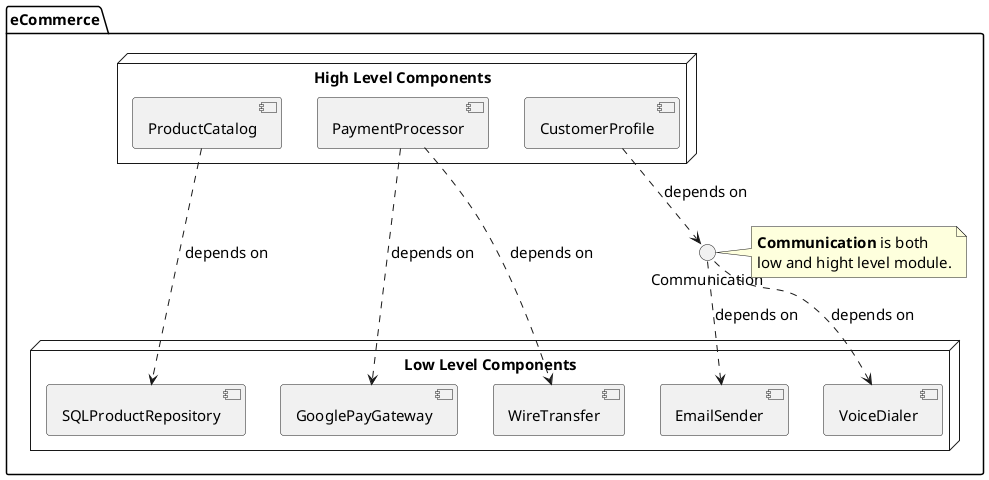
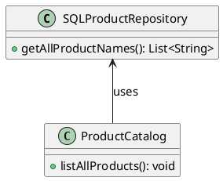
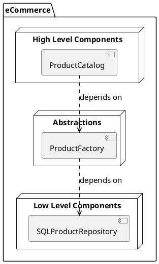
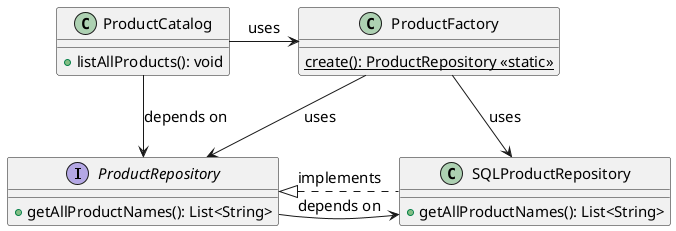

# Dependency Inversion Principle

- [Dependency Inversion Principle](#dependency-inversion-principle)
  - [Intro](#intro)
  - [eCommerce Example (bad design)](#ecommerce-example-bad-design)
  - [eCommerce Example (better design)](#ecommerce-example-better-design)

## Intro

> High-level modules should not depend on low-level modules. Both should depend on abstractions.

> Abstractions should not depend on details. Details should depend on abstractions.

## eCommerce Example (bad design)



Is `Communication` a high-level module, or a low-level module? Tricky question. It is both.

From the `CustomerProfile` module's perspective, then `Communication` is a low-level module, but from the `EmailSender` and `VoiceDialer` modules, it is high-level.

A module being high- or low-level is not an absolute fact, but a relative one. It depends on the context of the module relative to the surrounding modules.

Remember:
> **High-level modules should not depend on low-level modules. Both should depend on abstractions.**

Our “depends on” associations goes directly against the principle above. Our hight-level modules should depend on abstractions instead.

`ProductCatalog` (a high-level module) is directly depending on `SQLProductRepository` (a low level-module), violating the Dependency Inversion Principle.

Here's a class diagram of our bad design (considering only `ProductCatalog` for now):



## eCommerce Example (better design)

We should not instantiate `SQLProductRepository` directly. Instead, we should create a `ProductRepository` interface, and create a product repository factory abstraction to be used by `ProductCatalog. 



Here's a class diagram for the `ProductCatalog` high-level component:



Now, our reference type is `ProductRepository` (an interface), making it loosely coupled with `SQLProductRepository`.

```java
public class ProductCatalog {
  public void listAllProducts() {
    ProductRepository productRepository = ProductFactory.create();

    List<String> products = productRepository.getAllProductNames();

    for (String product : products) {
      System.out.println(product);
    }
  }
}
```

What about this?

> **Abstractions should not depend on details. Details should depend on abstractions.**

The low-level modules are the modules that deal with the details. Note that now `ProductRepository` depends on `SQLProductRepository`, and not the other way around. Great, we are following the guideline above as well.
